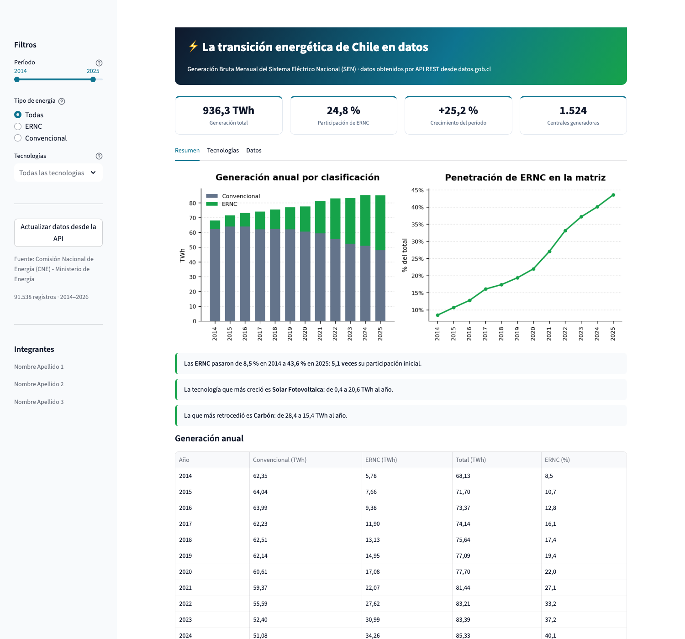
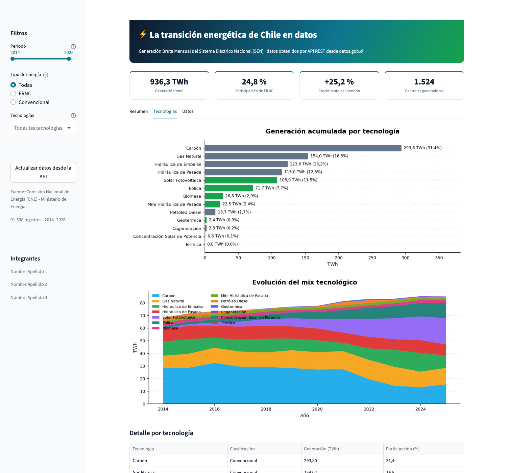
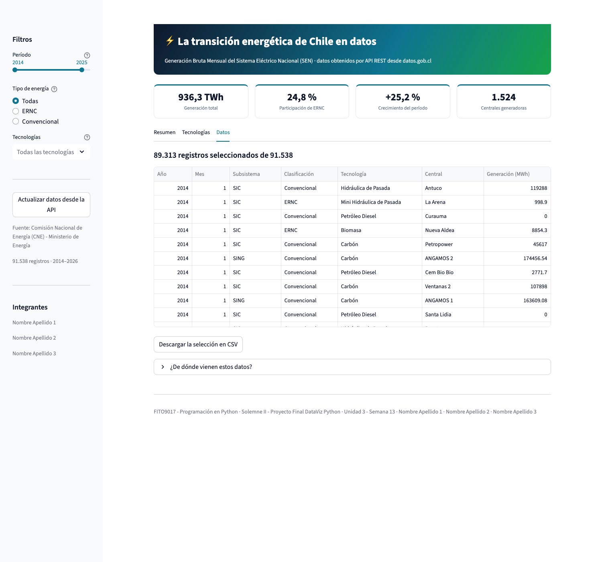

# Solemne II — Proyecto Final DataViz Python

**La transición energética de Chile en datos**
Análisis y presentación de datos obtenidos desde una API REST pública del
Gobierno de Chile (datos.gob.cl), con aplicación web interactiva en Streamlit.



<details>
<summary>Ver las otras dos pestañas</summary>




</details>

---

## ✅ Cómo hacer la entrega en 3 pasos

### Paso 1 — Poner los nombres del grupo
Abre `config.py` y edita **sólo** estas dos cosas:

```python
INTEGRANTES = [
    "Nombre Apellido 1",
    "Nombre Apellido 2",
    "Nombre Apellido 3",
]

NOMBRE_ARCHIVO_ENTREGA = "APELLIDO_NOMBRE_U3_SolemneII"
```

### Paso 2 — Generar el informe y el póster
```bash
pip install -r requirements.txt
python generar_entrega.py
```

Se crean dos documentos **Word editables** en esta carpeta:

| Archivo | Qué es |
|---|---|
| `APELLIDO_NOMBRE_U3_SolemneII.docx` | Informe completo (portada, desafío, dataset, proceso, 6 gráficos, hallazgos, aprendizajes, referencias) |
| `APELLIDO_NOMBRE_U3_SolemneII_Poster.docx` | Póster del proyecto, 1 página horizontal |

Ábrelos en Word, revisa o ajusta lo que quieras y expórtalos a PDF con
**Archivo → Guardar como… → Formato: PDF**.

### Paso 3 — Mostrar la aplicación web
```bash
streamlit run app.py
```
Se abre en `http://localhost:8501`. En macOS también puedes hacer doble clic
en `ejecutar.command`.

**Sube a la plataforma:** los dos PDF + esta carpeta con el código fuente.

---

## 🗂️ Estructura del proyecto

```
config.py             ← el único archivo que necesitas editar
api_datos.py          ← consultas GET a la API (requests + json + pandas)
analisis.py           ← agregaciones (pandas) y gráficos (matplotlib)
app.py                ← aplicación web interactiva (streamlit)
.streamlit/           ← tema fijo de la aplicación
generar_entrega.py    ← informe y póster en Word (python-docx)
requirements.txt      ← dependencias
ejecutar.command      ← doble clic para levantar la app (macOS)
cache_datos.json.gz  ← caché local de la API (se crea automáticamente)
assets/               ← gráficos exportados en PNG
```

El proyecto está separado en **tres capas** (acceso a datos, análisis y
presentación) para que la app y los documentos compartan exactamente el mismo
código de análisis: los números del informe nunca pueden contradecir los de la
aplicación.

---

## 📡 Fuente de datos

- **Recurso:** Generación Bruta Mensual del Sistema Eléctrico Nacional (SEN)
- **Organismo:** Comisión Nacional de Energía (CNE) — Ministerio de Energía
- **Portal:** <https://datos.gob.cl/dataset/generacion-bruta>
- **Volumen:** más de 91.000 registros, 2014 a la fecha, 1.500+ centrales,
  13 tecnologías

La obtención es **100 % vía API REST** (no descarga de archivos):

```
GET https://datos.gob.cl/api/3/action/datastore_search
    ?resource_id=389a1943-9c3d-4957-982a-58e3fb0c1bdb
    &limit=10000&offset=0
```

La API entrega como máximo 10.000 filas por respuesta, así que
`api_datos.descargar_registros()` recorre la paginación con `offset` hasta
completar el total que informa el servidor.

Para probar sólo la conexión con la API:
```bash
python api_datos.py
```

---

## 🖥️ Qué hace la aplicación

Interfaz simple, en español, con **tres filtros** y **tres pestañas**.

**Filtros** (barra lateral):

| Filtro | Qué hace |
|---|---|
| Período | Rango de años a analizar |
| Tipo de energía | Todas · ERNC · Convencional |
| Tecnologías | Vacío = todas; o elige las que quieras |

**Cuatro indicadores** que se recalculan con cada filtro: generación total,
participación de ERNC, crecimiento del período y número de centrales.

**Tres pestañas:**

| Pestaña | Contenido |
|---|---|
| Resumen | Mix anual ERNC vs Convencional, tres hallazgos automáticos y la tabla anual |
| Tecnologías | Ranking por tecnología, evolución del mix y tabla de detalle |
| Datos | Muestra de los registros, descarga en CSV y origen de los datos |

Además: botón **«Actualizar datos desde la API»** para forzar una descarga en
vivo desde datos.gob.cl.

Todos los números usan formato chileno (punto de miles, coma decimal) y el CSV
se descarga con punto y coma, para que Excel en español lo abra bien.

## 🔎 Hallazgos principales

- La participación de **ERNC** subió de **8,5 % (2014)** a **43,6 % (2025)**,
  mientras la generación total creció **+25,2 %**.
- **Solar Fotovoltaica** es el motor del cambio: de **0,4** a **20,6 TWh**
  anuales.
- **Carbón** está en retirada: de **28,4** a **15,4 TWh** anuales.
- La generación está muy concentrada: **15 de 1.524 centrales** producen cerca
  de un tercio de la energía del país.
- Renovables y convencionales tienen **estacionalidad opuesta** (verano vs.
  invierno).

---

## 🧰 Librerías utilizadas

`requests` · `json` · `pandas` · `matplotlib` · `streamlit` · `python-docx`

---

## ☁️ Publicar la aplicación en línea

La solemne acepta *«un enlace a la aplicación desplegada»*. Con el código ya en
GitHub, obtener ese enlace toma dos minutos y es gratis:

1. Entra a <https://share.streamlit.io> e inicia sesión con tu cuenta de GitHub.
2. **Create app → Deploy a public app from GitHub**.
3. Completa:
   - **Repository:** `piperap/app-ministerio-energia`
   - **Branch:** `main`
   - **Main file path:** `app.py`
4. **Deploy**. Queda una URL pública del tipo
   `https://app-ministerio-energia.streamlit.app`

Streamlit Cloud instala solo lo que está en `requirements.txt`. El archivo
`cache_datos.json.gz` viaja en el repositorio a propósito: así la aplicación
arranca al instante y sigue funcionando aunque la API de datos.gob.cl esté
lenta o caída el día de la presentación.

---

## 🔒 Seguridad

- El proyecto **no usa claves ni tokens**: la API de datos.gob.cl es pública y
  de solo lectura (`GET`).
- El `.gitignore` bloquea `.env`, `*.pem`, `*.key` y `secrets.toml` por si más
  adelante alguien agrega credenciales.
- Los datos publicados son **datos abiertos de generación eléctrica**: no
  contienen información personal.
- Este repositorio es **público**: cualquier nombre que escribas en
  `config.py` queda visible en Internet.

---

## ❓ Problemas frecuentes

| Situación | Solución |
|---|---|
| `ModuleNotFoundError` | `pip install -r requirements.txt` |
| La app tarda la primera vez | Está descargando 91.000 registros desde la API; queda en `cache_datos.json.gz` y las siguientes veces es instantánea |
| Quiero datos frescos | Botón «Actualizar desde la API», o borra `cache_datos.json.gz` |
| Sin conexión a Internet | La app funciona con la caché local, siempre que `cache_datos.json.gz` exista |
| `streamlit: command not found` | Usa `python -m streamlit run app.py` |
